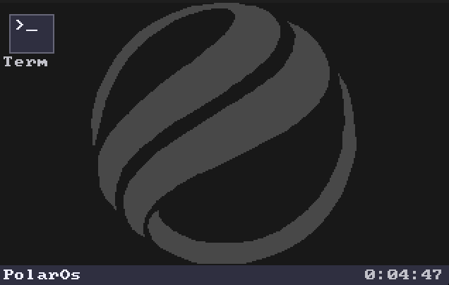

<div align="center">



# PolarOS

🧊 A custom x86_64 operating system written in Rust

[](https://www.rust-lang.org/)
[]()

</div>

---

## Features

- **Custom kernel** — GDT, IDT, PIC, timer, memory management (paging, heap, frame allocator)
- **GUI** — framebuffer-based compositor, windowing system, cursor, wallpaper, theming
- **Drivers** — VGA, ATA, PS/2 keyboard & mouse, serial
- **File systems** — FAT and RAM filesystem support
- **Shell** — built-in shell with tab completion
- **Multitasking** — scheduler, context switching, ELF loading
- **Syscalls** — user-space program support

## Building

```bash
cargo bootimage
```

## Running

```bash
qemu-system-x86_64 -drive format=raw,file=target/x86_64-myos/debug/bootimage-systemoperacyjny.bin
```
